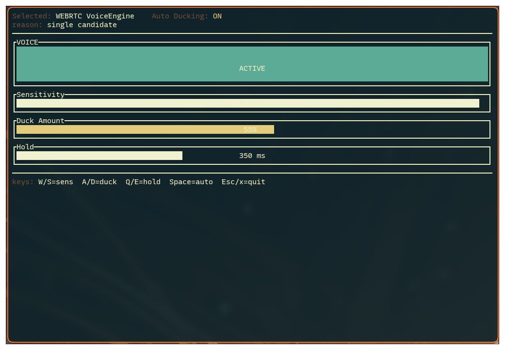

# pw-duck



pw-duck is free and open-source software written in Rust that provides automatic audio ducking on Linux.

It is designed for voice chat scenarios where background audio (games, media) should be temporarily attenuated while remote speech is active.
pw-duck operates entirely in user space, integrates directly with PipeWire, and maintains a strong focus on simplicity.

The tool prioritizes correctness and predictability over feature breadth.

## Background

Linux does not provide a general-purpose mechanism for automatic audio ducking.

While PipeWire exposes detailed control over audio streams, routing, and volume, it does not include logic to automatically attenuate background audio based on voice activity. Existing solutions typically rely on manual routing, effect chains, or application-specific behavior.

pw-duck implements audio ducking as a standalone user-space tool.
It observes relevant output streams and applies controlled attenuation to other audio while voice activity is present.

I wrote the initial implementation in a single day of my personal spare time as a self-taught programmer, after a straightforward request for this functionality had remained unaddressed by Discord.

The code aims to demonstrate that reliable audio ducking on Linux can be implemented with relatively little effort when built directly on PipeWire.

## Requirements

* Linux with PipeWire
* Rust toolchain (Cargo)

## Run

From the repository root:

```sh
cargo run --release
```

## Install

### NixOS / Nix

Use this flake.

### Arch Linux (AUR)

Install from AUR.

## Issues

GitHub Issues can be used for bug reports and feature requests.

This project is developed and maintained in my personal spare time.
As a result, responses and fixes may take a while.
